##.....................................................................................................ANSIBLE CONFIGURATION MANAGEMENT....................

**INSTALL AND CONFIGURE ANSIBLE ON EC2 INSTANCE**
Update the Name tag on your Jenkins EC2 Instance to Jenkins-Ansible. We will use this server to run playbooks.

In your GitHub account create a new repository and name it ansible-config-mgt.

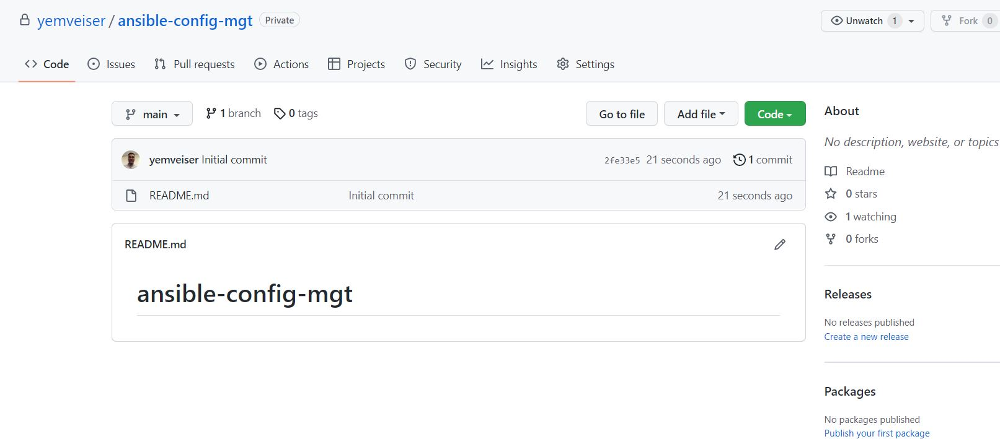

Install Ansible
```
sudo apt update

sudo apt install ansible
```
Confirm ansible is installed by checking the version.
``ansible --version``
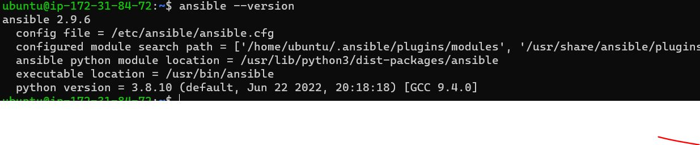

Configure Jenkins build job to save your repository content every time you change it asdone in my Devops tooling project [here](https://github.com/yemveiser/AWS-TOOLING-WEBSITE-DEPLOYMENT-AUTOMATION-WITH-CONTINUOUS-INTEGRATION--P9).

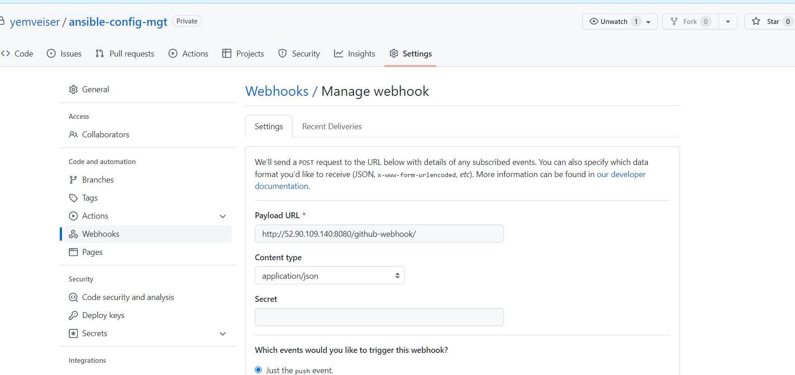

- Create a new Freestyle project ansible in Jenkins and point it to your ‘ansible-config-mgt’ repository.
- Configure Webhook in GitHub and set webhook to trigger ansible build.
- Configure a Post-build job to save all (**) files.

est your setup by making some change in README.MD file in master branch and make sure that builds starts automatically and Jenkins saves the files (build artifacts) in following folder

`ls /var/lib/jenkins/jobs/ansible/builds/<build_number>/archive/`

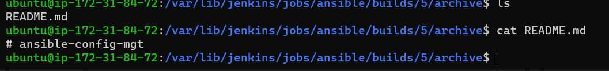

**Prepare your development environment using Visual Studio Code**

Clone down your ansible-config-mgt repo to your Jenkins-Ansible instance.

`git clone https://github.com/yemveiser/ansible-config-mgt.git`

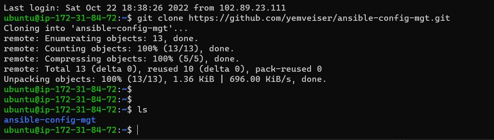

**....................ANSIBLE DEVELOPMENT..................**

In your ansible-config-mgt GitHub repository, create a new branch that will be used for development of a new feature.

Checkout the newly created feature branch to your local machine and start building your code and directory structure
- Create a directory and name it playbooks – it will be used to store all your playbook files.
- Create a directory and name it inventory – it will be used to keep your hosts organised.
- Within the playbooks folder, create your first playbook, and name it common.yml
- Within the inventory folder, create an inventory file (.yml) for each environment (Development, Staging Testing and Production) dev, staging, uat, and prod respectively.

**Set up an Ansible Inventory**

An Ansible inventory file defines the hosts and groups of hosts upon which commands, modules, and tasks in a playbook operate. Since our intention is to execute Linux commands on remote hosts, and ensure that it is the intended configuration on a particular server that occurs. It is important to have a way to organize our hosts in such an Inventory.

We will use SSH agent to connect VS Code to the Jenkins-Ansible instance

ssh-add <path-to-private-key>

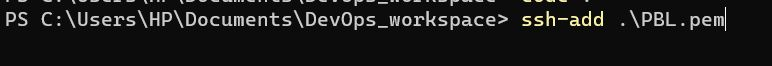

Confirm the key has been added with the command below, you should see the name of your key.

```
ssh-add -l
```
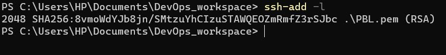

Now, ssh into your Jenkins-Ansible server using ssh-agent
`ssh -A ubuntu@<jenkins-server-ip>`

We used user ubuntu because the Load Balancer user is ubuntu, the user for RHEL-based servers is ec2-user.

Update your inventory/dev.yml file with this snippet of code:
```
[nfs]
<NFS-Server-Private-IP-Address> ansible_ssh_user='ec2-user'

[webservers]
<Web-Server1-Private-IP-Address> ansible_ssh_user='ec2-user'
<Web-Server2-Private-IP-Address> ansible_ssh_user='ec2-user'

[db]
<Database-Private-IP-Address> ansible_ssh_user='ec2-user' 

[lb]
<Load-Balancer-Private-IP-Address> ansible_ssh_user='ubuntu'
```
**CREATE A COMMON PLAYBOOK**

It is time to start giving Ansible the instructions on what you needs to be performed on all servers listed in inventory/dev.

In common.yml playbook you will write configuration for repeatable, re-usable, and multi-machine tasks that is common to systems within the infrastructure.

Update your playbooks/common.yml file with following code:

```
---
- name: update web, nfs and db servers
  hosts: webservers, nfs, db
  remote_user: ec2-user 
  become: yes
  become_user: root 
  tasks:
    - name: ensure wireshark is at the latest version
      yum:
        name: wireshark
        state:  latest

- name: update LB server
  hosts: lb 
  remote_user: ubuntu
  become: yes
  become_user: root 
  tasks:
    - name: Update apt repo 
      apt: 
        update_cache: yes
    - name: ensure wireshark is at the latest version
      apt:  
        name: wireshark
        state:  latest

- name: Create a directory
  hosts: webservers
  remote_user: ec2-user
  become: yes
  become_user: root 
  tasks:
    - name: Create a directory
      file:
      path: /var/test
      state: directory
      mode: '0755'

- name: Create a file
  hosts: webservers
  remote_user: ec2-user
  become: yes
  become_user: root 
  tasks:
    - name: Create a file
      file:
      path: /var/test/ans_file
      state: touch
      mode: u=rwx,g=r,o=r
```
This playbook is divided into 4 parts, the firts two is intended to perform the same task: install wireshark utility (or make sure it is updated to the latest version) on your RHEL 8 and Ubuntu servers. It uses root user to perform this task and respective package manager: yum for RHEL 8 and apt for Ubuntu. the last two task are to create a directory named "test"and file named "ans_file" on the webservers.

**--------Update GIT with the latest code-------------**

Now all of your directories and files live on your machine and you need to push changes made locally to GitHub.

Now you have a separate branch, you will need to know how to raise a Pull Request (PR), get your branch peer reviewed and merged to the master branch.

Commit your code into GitHub:
- use git commands to add, commit and push your branch to GitHub.
  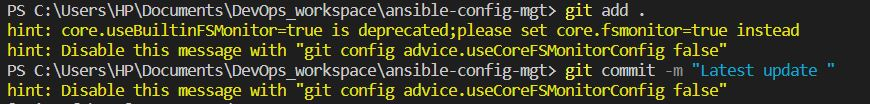
Create a Pull request (PR)

- Wear a hat of another developer for a second, and act as a reviewer.

- If the reviewer is happy with your new feature development, merge the code to the master branch.

- Head back on your terminal, checkout from the feature branch into the master, and pull down the latest changes.

Once your code changes appear in master branch – Jenkins will do its job and save all the files (build artifacts) to /var/lib/jenkins/jobs/ansible/builds/<build_number>/archive/ directory on Jenkins-Ansible server.

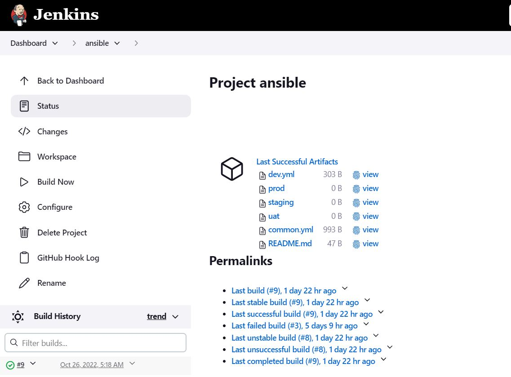
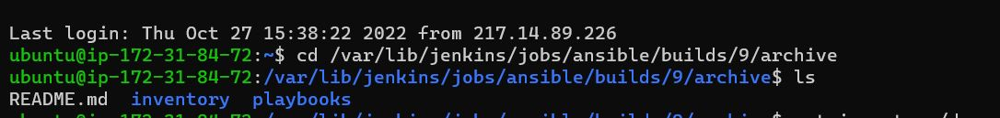

**Run first Ansible test**

```
cd ansible-config-mgt
ansible-playbook -i inventory/dev.yml playbooks/common.yml
```

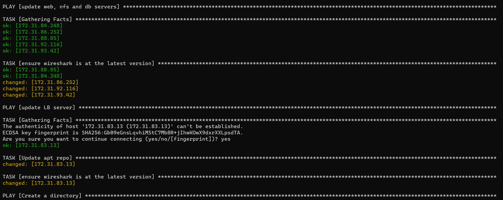

You can go to each of the servers and check if wireshark has been installed by running which wireshark or wireshark --version

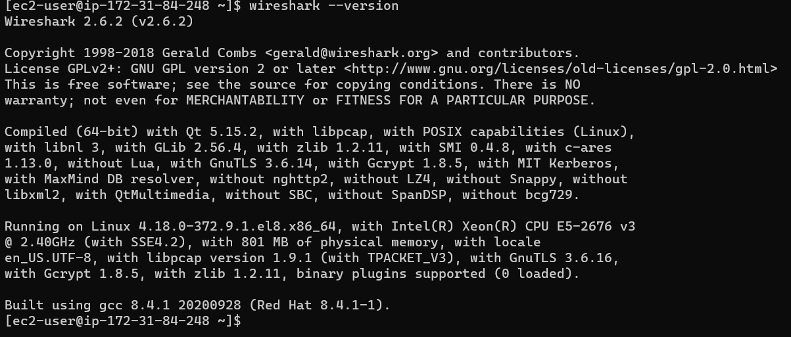

You can also confirm the Folder and file was created with the right permissions.

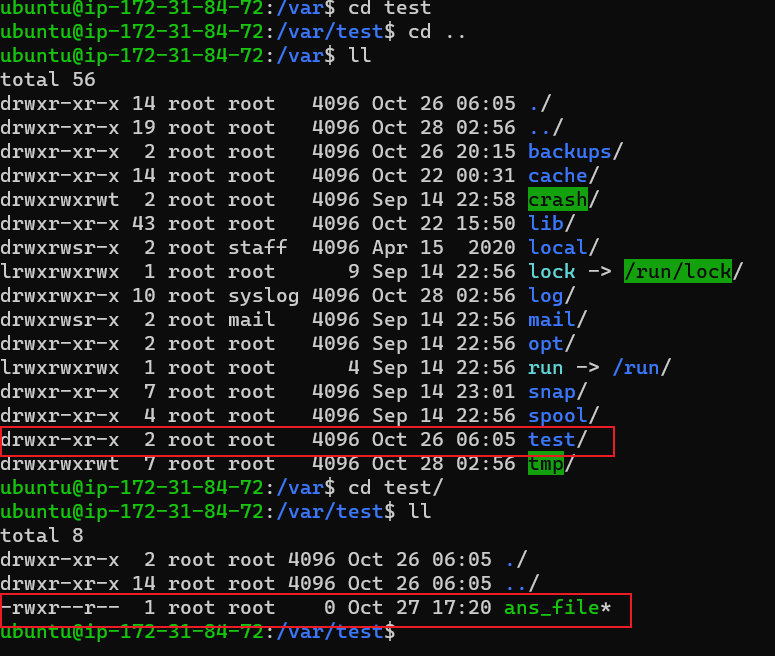

We have successfully updated our architecture to the design below.

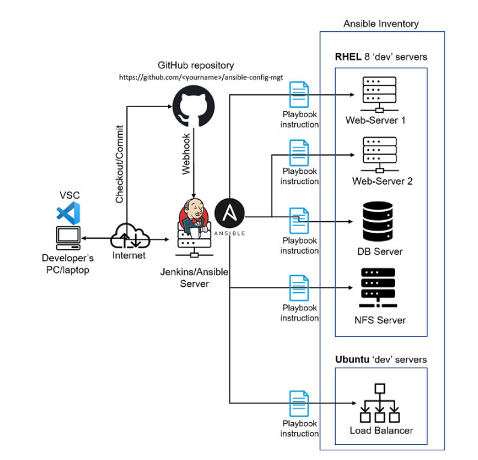

*GREAT!!!!*