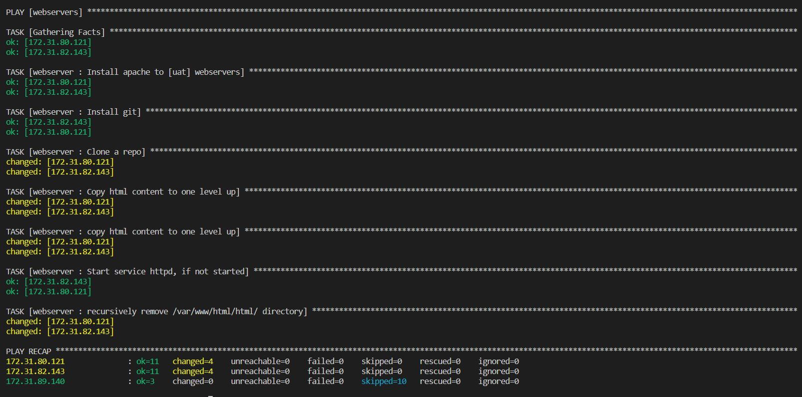

## Introducing Dynamic Assignment Into Our structure
In your https://github.com/<your-name>/ansible-config-mgt GitHub repository start a new branch and call it dynamic-assignments.


Create a new folder, name it dynamic-assignments. Then inside this folder, create a new file and name it env-vars.yml. We will instruct site.yml to include this playbook later. For now, let us keep building up the structure.

Your GitHub shall have following structure by now.

````
├── dynamic-assignments
│   └── env-vars.yml
├── inventory
│   └── dev
    └── stage
    └── uat
    └── prod
└── playbooks
    └── site.yml
└── roles (optional folder)
    └──...(optional subfolders & files)
└── static-assignments
    └── common.yml
````

Since we will be using the same Ansible to configure multiple environments, and each of these environments will have certain unique attributes, such as servername, ip-address etc., we will need a way to set values to variables per specific environment.

For this reason, we will now create a folder to keep each environment’s variables file. Therefore, create a new folder env-vars, then for each environment, create new YAML files which we will use to set variables.

Your layout should now look like this.

````
├── dynamic-assignments
│   └── env-vars.yml
├── env-vars
    └── dev.yml
    └── stage.yml
    └── uat.yml
    └── prod.yml
├── inventory
    └── dev
    └── stage
    └── uat
    └── prod
├── playbooks
    └── site.yml
└── static-assignments
    └── common.yml
    └── webservers.yml
````
Now paste the instruction below into the env-vars.yml file.

```
---
- name: collate variables from env specific file, if it exists
  hosts: all
  tasks:
    - name: looping through list of available files
      include_vars: "{{ item }}"
      with_first_found:
        - files:
            - dev.yml
            - stage.yml
            - prod.yml
            - uat.yml
          paths:
            - "{{ playbook_dir }}/../env-vars"
      tags:
        - always
```

Notice 3 things to notice here:

- We used include_vars syntax instead of include, this is because Ansible developers decided to separate different features of the module. From Ansible version 2.8, the include module is deprecated and variants of include_* must be used. These are:
include_role
include_tasks
include_vars
In the same version, variants of import were also introduces, such as:
import_role
import_tasks
- We made use of a special variables { playbook_dir } and { inventory_file }. { playbook_dir } will help Ansible to determine the location of the running playbook, and from there navigate to other path on the filesystem. { inventory_file } on the other hand will dynamically resolve to the name of the inventory file being used, then append .yml so that it picks up the required file within the env-vars folder.
- We are including the variables using a loop. with_first_found implies that, looping through the list of files, the first one found is used. This is good so that we can always set default values in case an environment specific env file does not exist.

**UPDATE SITE.YML WITH DYNAMIC ASSIGNMENTS**

Update site.yml file to make use of the dynamic assignment. 

````
---
- hosts: all
- name: Include dynamic variables 
  tasks:
  import_playbook: ../static-assignments/common.yml 
  include: ../dynamic-assignments/env-vars.yml
  tags:
    - always

-  hosts: webservers
- name: Webserver assignment
  import_playbook: ../static-assignments/webservers.yml
````

**Community Roles**

Now it is time to create a role for MySQL database – it should install the MySQL package, create a database and configure users. But why should we re-invent the wheel? There are tons of roles that have already been developed by other open source engineers out there. These roles are actually production ready, and dynamic to accomodate most of Linux flavours. With Ansible Galaxy again, we can simply download a ready to use ansible role, and keep going.

**Download Mysql Ansible Role**

You can browse available community roles [here](https://galaxy.ansible.com/home)

We will be using a MySQL role developed by [geerlingguy]


Tp preserve the github make a commit and push to master in your ‘``ansible-config-mgt``’ directory
we can also configure Visual Studio Code to work with this directory. In this case, you will no longer need webhook and Jenkins jobs to update your codes on Jenkins-Ansible server

Git should be installed on Jenkins-Ansible server, confirm that git is installed with git --version, then go to ‘ansible-config-mgt’ directory and run the below command


```
git init
git pull https://github.com/<your-name>/ansible-config-mgt.git
git remote add origin https://github.com/<your-name>/ansible-config-mgt.git
git branch roles-feature
git switch roles-feature
```
Inside roles directory create your new MySQL role with ansible-galaxy install geerlingguy.mysql and rename the folder to mysql

``mv geerlingguy.mysql/ mysql``

Read README.md file, and edit roles configuration to use correct credentials for MySQL required for the tooling website.

 you can create a Pull Request and merge it to main branch on GitHub if the codes are ok.

 **LOAD BALANCER ROLES**

We want to be able to choose which Load Balancer to use, Nginx or Apache, so we need to have two roles respectively:

- Nginx
- Apache

We will create the roles by using the ``ansible-galaxy <role-name> init`` command.

Since we cannot use both Nginx and Apache load balancer, we need to add a condition to enable either one – this is where we can make use of variables.

Declare a variable in defaults/main.yml file inside the Nginx and Apache roles. Name each variables enable_nginx_lb and enable_apache_lb respectively.

Set both values to false like this enable_nginx_lb: false and enable_apache_lb: false.

Declare another variable in both roles load_balancer_is_required and set its value to false as well

Update both assignment and site.yml files respectively

update the ``loadbalancers.yml file`` in the static-assignments folder with the below scripts.

````
- hosts: lb
  roles:
    - { role: nginx, when: enable_nginx_lb and load_balancer_is_required }
    - { role: apache, when: enable_apache_lb and load_balancer_is_required }
````

Also update the sites.yml file under playbooks folder with the scripts.

````
     - name: Loadbalancers assignment
       hosts: lb
         - import_playbook: ../static-assignments/loadbalancers.yml
        when: load_balancer_is_required 
````

Now you can make use of env-vars\uat.yml file to define which loadbalancer to use in UAT environment by setting respective environmental variable to true.

You will activate load balancer, and enable nginx by setting these in the respective environment’s env-vars file.

update the uat.yml file under the env_vars folder with the below script.

````
enable_nginx_lb: true
load_balancer_is_required: true
````
Do same with apache LB, if, by setting respective environmental variable to true and the nginx LB to false if you want to enable apache instead.


lets update inventory for uat environment and run Ansible against the environment to test.



We have successfully used Ansible configuration management tool to prepare UAT environment for Tooling web solution.


