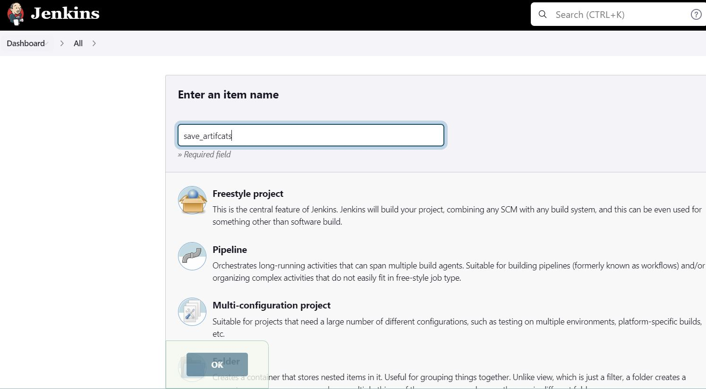

In this project we will continue working with ansible-config-mgt repository and make some improvements of your code. we need to refactor the Ansible code, create assignments, and learn how to use the imports functionality. Imports allow to effectively re-use previously created playbooks in a new playbook – it allows you to organize your tasks and reuse them when needed.

**Code Refactoring**

Refactoring is a general term in computer programming. It means making changes to the source code without changing expected behaviour of the software. The main idea of refactoring is to enhance code readability, increase maintainability and extensibility, reduce complexity, add proper comments without affecting the logic.

**Jenkins job enhancement**

Before we begin, let us make some changes to our Jenkins job – now every new change in the codes creates a separate directory which is not very convenient when we want to run some commands from one place. Besides, it consumes space on Jenkins serves with each subsequent change. Let us enhance it by introducing a new Jenkins project/job – we will require Copy Artifact plugin.


Go to your Jenkins-Ansible server and create a new directory called ansible-config-artifact – we will store there all artifacts after each build.

`sudo mkdir /home/ubuntu/ansible-config-artifact`

Create a new Freestyle project (you have done it in Project 9) and name it save_artifacts.


This project will be triggered by completion of your existing ansible project.


The main idea of save_artifacts project is to save artifacts into /home/ubuntu/ansible-config-artifact directory. To achieve this, create a Build step and choose Copy artifacts from other project, specify ansible as a source project and /home/ubuntu/ansible-config-artifact as a target directory.


Test your set up by making some change in README.MD file inside your ansible-config-mgt repository (right inside master branch).
If both Jenkins jobs have completed one after another – you shall see your files inside /home/ubuntu/ansible-config-artifact directory and it will be updated with every commit to your master branch.


**---------Refactor Ansible code by importing other playbooks into site.yml---------**

Before starting to refactor the codes, ensure that you have pulled down the latest code from master (main) branch, and created a new branch, name it ``refactor``.


Within playbooks folder, create a new file and name it ``site.yml`` – This file will now be considered as an entry point into the entire infrastructure configuration. Other playbooks will be included here as a reference. In other words, ``site.yml`` will become a parent to all other playbooks that will be developed.

Create a new folder in root of the repository and name it static-assignments. The static-assignments folder is where all other children playbooks will be stored. 

``mkdir static-assignments``

Move common.yml file into the newly created static-assignments folder.

``mv common.yml ../static-assignments``

Inside site.yml file, import common.yml playbook.

```
---
- hosts: all
- import_playbook: ../static-assignments/common.yml
```

The code above uses built in import_playbook Ansible module.

Your folder structure should look like this.

```
├── static-assignments
│   └── common.yml
├── inventory
    └── dev
    └── stage
    └── uat
    └── prod
└── playbooks
    └── site.yml
```

Run ansible-playbook command against the dev environment

````
cd /home/ubuntu/ansible-config-mgt/

ansible-playbook -i inventory/dev.yml playbooks/site.yaml
````


Now we have a ready solution to install/delete packages on multiple servers with just one command.

**----------------CONFIGURE UAT WEBSERVERS WITH A ROLE ‘WEBSERVER’--------**

Launch 2 fresh EC2 instances using RHEL 8 image, we will use them as our uat servers, so give them names accordingly – Web1-UAT and Web2-UAT.

create a role, you must create a directory called roles/, relative to the playbook file or in /etc/ansible/ directory.

Create the directory/files structure manually in your git repo and push to the master branch.
````
└── webserver
    ├── README.md
    ├── defaults
    │   └── main.yml
    ├── handlers
    │   └── main.yml
    ├── meta
    │   └── main.yml
    ├── tasks
    │   └── main.yml
    └── templates
````

Update your inventory ansible-config-mgt/inventory/uat.yml file with IP addresses of your 2 UAT Web servers

````
[uat]
172.31.80.121 ansible_ssh_user='ec2-user'
172.31.82.143 ansible_ssh_user='ec2-user'
````

In /etc/ansible/ansible.cfg file uncomment roles_path string and provide a full path to your roles directory roles_path    = /home/ubuntu/ansible-config-mgt/roles, so Ansible could know where to find configured roles.

It is time to start adding some logic to the webserver role. Go into tasks directory, and within the main.yml file, start writing configuration tasks to do the following:

- Install and configure Apache (httpd service)
- Clone Tooling website from GitHub https://github.com/yemveiser/tooling.git
- Ensure the tooling website code is deployed to /var/www/html on each of 2 UAT Web servers.
- Make sure httpd service is started

Ass the below tasks to the `main.yml` file.

````
---
- name: install apache
  become: true
  ansible.builtin.yum:
    name: "httpd"
    state: present

- name: install git
  become: true
  ansible.builtin.yum:
    name: "git"
    state: present

- name: clone a repo
  become: true
  ansible.builtin.git:
    repo: https://github.com/<your-name>/tooling.git
    dest: /var/www/html
    force: yes

- name: copy html content to one level up
  become: true
  command: cp -r /var/www/html/html/ /var/www/

- name: Start service httpd, if not started
  become: true
  ansible.builtin.service:
    name: httpd
    state: started

- name: recursively remove /var/www/html/html/ directory
  become: true
  ansible.builtin.file:
    path: /var/www/html/html
    state: absent
````

**Reference ‘Webserver’ role**
Within the ``static-assignments`` folder, create a new assignment for uat-webservers ``uat-webservers.yml``. This is where you will reference the role.

````
---
- hosts: uat-webservers
  roles:
     - webserver
````
Remember that the entry point to our ansible configuration is the ``site.yml`` file. Therefore, you need to refer your ``uat-webservers.yml`` role inside ``site.yml``.

So, we should have this in site.yml

````
---
- hosts: all
- import_playbook: ../static-assignments/common.yml

- hosts: uat-webservers
- import_playbook: ../static-assignments/uat-webservers.yml
````

**Commit & Test**

Commit your changes, create a Pull Request and merge them to master branch, make sure webhook triggered two consequent Jenkins jobs, they ran successfully and copied all the files to your Jenkins-Ansible server into /home/ubuntu/ansible-config-mgt/ directory.

Now run the playbook against your uat inventory and see what happens:

````
sudo ansible-playbook -i /home/ubuntu/ansible-config-mgt/inventory/uat.yml /home/ubuntu/ansible-config-mgt/playbooks/site.yaml
````


You should be able to see both of your UAT Web servers configured and you can try to reach them from your browser:

``http://<Web1-UAT-Server-Public-IP-or-Public-DNS-Name>/index.php``


Our Ansible architecture now looks like this:


We have been able to deploy and configure UAT Web Servers using Ansible imports and roles!


