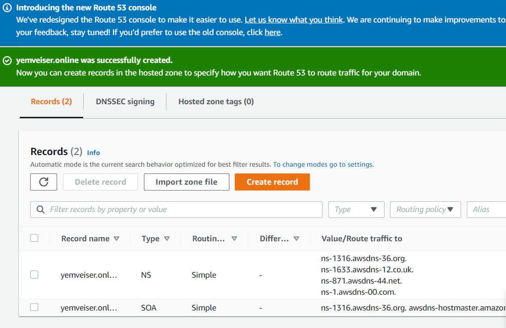
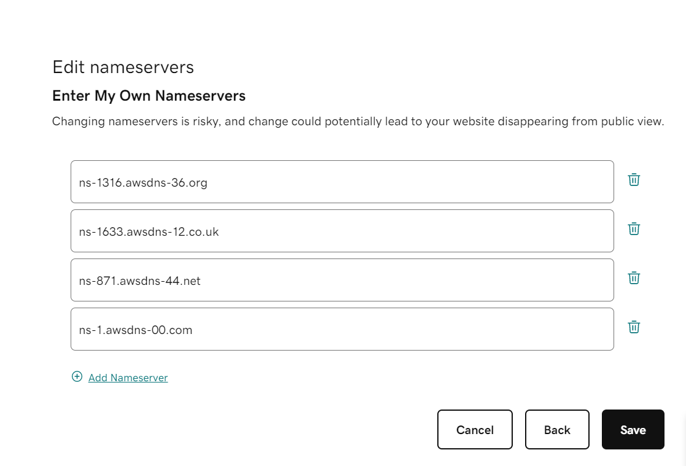
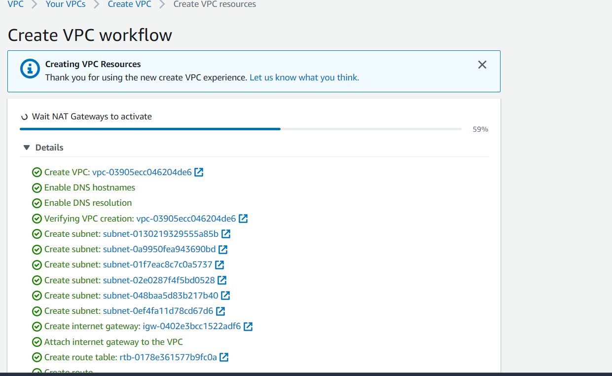
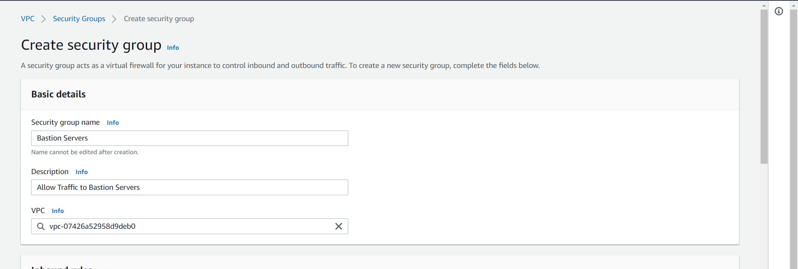
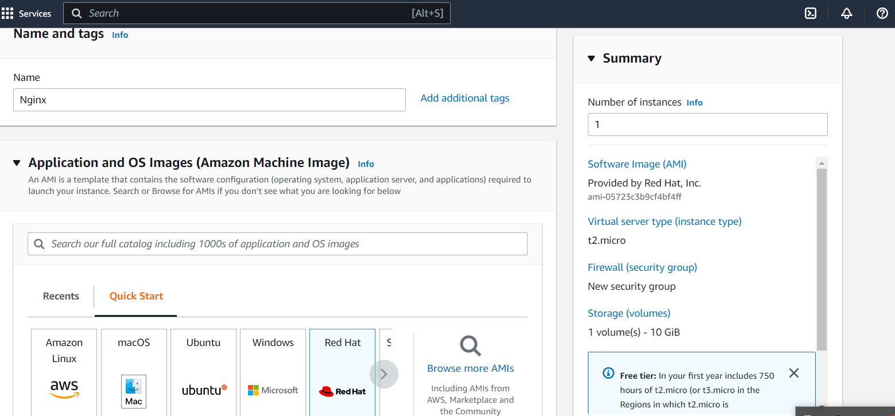
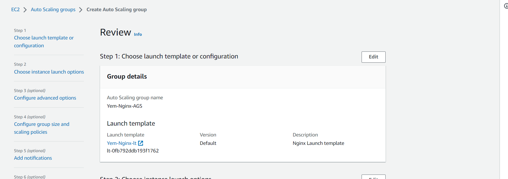

## 
We will build a secure infrastructure inside AWS VPC (Virtual Private Cloud) network for **Yemveiser** a fictitious company that uses WordPress CMS for its main business website, and a Tooling Website for their DevOps team. As part of the company’s desire for improved security and performance, a decision has been made to use a reverse proxy technology from NGINX to achieve this.

Cost, Security, and Scalability are the major requirements for this project. Hence, implementing the architecture designed below, ensure that infrastructure for both websites, WordPress and Tooling, is resilient to Web Server’s failures, can accomodate to increased traffic and, at the same time, has reasonable cost.


Lets Start of the Project, we however need to meet some requirements before we set out with creating our infastructure.

Properly configure your AWS account and Organization. 
- Create an AWS Master account. (Also known as Root Account)
- Within the Root account, create a sub-account and name it DevOps. (You will need another email address to complete this)
- Within the Root account, create an AWS Organization Unit (OU). Name it Dev. (We will launch Dev resources in there)
- Move the DevOps account into the Dev OU.
- Login to the newly created AWS account using the new email address.

Create a domain name for your company, you can create for free at [freenom](https://www.freenom.com/). i have created one called yemveiser.online using godaddy.

Create a hosted zone in AWS, and map it to the domain name created


Nameservers from hosted zone have been mapped to the domain name



**SET UP A VIRTUAL PRIVATE NETWORK (VPC)**

We will always make reference to the architecture document at the start of the page.
lets create the below resources.
- Create a VPC
- Create subnets as shown in the architecture
- Create a route table and associate it with public subnets
- Create a route table and associate it with private subnets
- Create an Internet Gateway
- Edit a route in public route table, and associate it with the Internet Gateway. (This is what allows a public subnet to be accisble from the Internet)
- Create 3 Elastic IPs
- Create a Nat Gateway and assign one of the Elastic IPs (*The other 2 will be used by Bastion hosts)



**Create a Security Group for:**

**Nginx Servers:** Access to Nginx should only be allowed from a Application Load balancer (ALB). if you have not created a load balancer,you can put some dummy records as a place holder.

**Bastion Servers:** Access to the Bastion servers should be allowed only from workstations that need to SSH into the bastion servers. Hence, you can use your workstation public IP address. To get this information, simply go to your terminal and type curl www.canhazip.com
**Application Load Balancer:** ALB will be available from the Internet
**Webservers:** Access to Webservers should only be allowed from the Nginx servers. Since we do not have the servers created yet, just put some dummy records as a place holder, we will update it later.
**Data Layer:** Access to the Data layer, which is comprised of Amazon Relational Database Service (RDS) and Amazon Elastic File System (EFS) must be carefully desinged – only webservers should be able to connect to RDS, while Nginx and Webservers will have access to EFS Mountpoint.



Lets Proceed With setting up the our Compute Resources inside the VPC we created.
The recources related to compute are:

EC2 Instances
Launch Templates
Target Groups
Autoscaling Groups
TLS Certificates
Application Load Balancers (ALB)

**Provision EC2 Instances for Nginx, Bastion, webservers and Tooling servers**
Create an EC2 Instance based on RedHat Amazon Machine Image (AMI) in any 2 Availability Zones (AZ) in any AWS Region.



Ensure that it has the following software installed:

- python
- ntp
- net-tools
- vim
- wget
- telnet
- epel-release
- htop

Run the below commands to install the softwares.
```
yum install -y https://dl.fedoraproject.org/pub/epel/epel-release-latest-8.noarch.rpm

yum install -y dnf-utils http://rpms.remirepo.net/enterprise/remi-release-8.rpm

yum install wget vim python3 telnet htop git mysql net-tools chrony -y

systemctl start chronyd

systemctl enable chronyd
```
Now, you will need to create 2 separate launch templates for both the WordPress and Tooling websites

Create an EC2 Instance (Centos) each for WordPress and Tooling websites per Availability Zone (in the same Region).
Repeat the same process for the other servers. 

Make use of the AMI to set up a launch template
Ensure the Instances are launched into a public subnet
Assign appropriate security group
Configure Userdata to update yum package repository and install wordpress (Only required on the WordPress launch template)

**webserver ami installation**
```
yum install -y https://dl.fedoraproject.org/pub/epel/epel-release-latest-8.noarch.rpm

yum install -y dnf-utils http://rpms.remirepo.net/enterprise/remi-release-8.rpm

yum install wget vim python3 telnet htop git mysql net-tools chrony -y

systemctl start chronyd

systemctl enable chronyd
```
**Configure selinux policies for the webservers and nginx servers**
```
setsebool -P httpd_can_network_connect=1
setsebool -P httpd_can_network_connect_db=1
setsebool -P httpd_execmem=1
setsebool -P httpd_use_nfs 1
```
Associate an Elastic IP with each of the Bastion EC2 Instances
Create an AMI out of the EC2 instance

Prepare Launch Template For Bastion (One per subnet)
Make use of the AMI to set up a launch template
Ensure the Instances are launched into a public subnet
Assign appropriate security group
Configure Userdata to update yum package repository and install Ansible and git

**Next Lets configure target groups for the EC2 Instances.**
Configure Target Groups
Select Instances as the target type
Ensure the protocol HTTPS on secure TLS port 443
Ensure that the health check path is /healthstatus
Register Nginx Instances as targets
Ensure that health check passes for the target group



